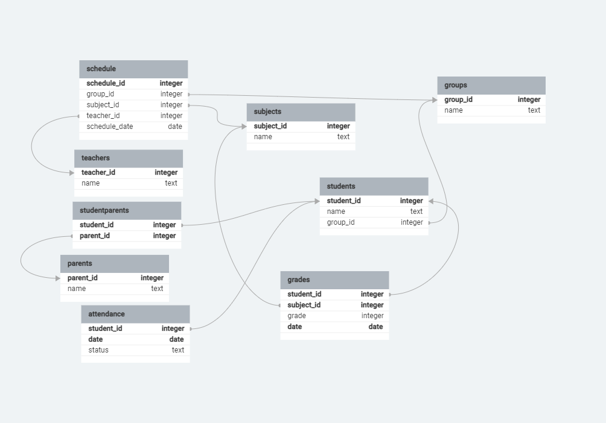

# НИЯУ МИФИ. ИИКС. Лабораторная работа №1-1. «Построение модели данных». Ступпнков Иван Б20-505. 2023.
## Обзор предметной области

Рассматриваемая предметная область - Организация, проводящая соревнования. Есть расписание, ученики, их родители и учителя.

## Диаграмма сущностей

## Спецификация таблиц

### Disciplines

| Название Поля   | Тип                        | Описание                          | Первичный ключ? | Внешний ключ? |
|-----------------|----------------------------|----------------------------------|-----------------|---------------|
| DisciplineID    | Unique Identifier          | ID дисциплины                     | Да              | Нет           |
| Name            | Text                       | Название дисциплины               | Нет             | Нет           |
| Description     | Text                       | Описание дисциплины               | Нет             | Нет           |

### Teams

| Название Поля   | Тип                        | Описание                          | Первичный ключ? | Внешний ключ?             |
|-----------------|----------------------------|----------------------------------|-----------------|---------------------------|
| TeamID          | Unique Identifier          | ID команды                        | Да              | Нет                       |
| Name            | Text                       | Название команды                  | Нет             | Нет                       |
| DisciplineID    | Foreign Key to Disciplines | ID дисциплины                     | Нет             | Да (Disciplines.DisciplineID) |

### Participants

| Название Поля   | Тип                        | Описание                          | Первичный ключ? | Внешний ключ?         |
|-----------------|----------------------------|----------------------------------|-----------------|-----------------------|
| ParticipantID   | Unique Identifier          | ID участника                      | Да              | Нет                   |
| Name            | Text                       | Имя участника                     | Нет             | Нет                   |
| Age             | Int                        | Возраст участника                 | Нет             | Нет                   |
| TeamID          | Foreign Key to Teams       | ID команды                        | Нет             | Да (Teams.TeamID)      |

### Competitions

| Название Поля   | Тип                        | Описание                          | Первичный ключ? | Внешний ключ?                 |
|-----------------|----------------------------|----------------------------------|-----------------|---------------------------|
| CompetitionID   | Unique Identifier          | ID соревнования                   | Да              | Нет                       |
| Name            | Text                       | Название соревнования             | Нет             | Нет                       |
| Date            | Date                       | Дата соревнования                 | Нет             | Нет                       |
| DisciplineID    | Foreign Key to Disciplines | ID дисциплины                     | Нет             | Да (Disciplines.DisciplineID) |

### TeamResults

| Название Поля   | Тип                        | Описание                          | Первичный ключ? | Внешний ключ?                 |
|-----------------|----------------------------|----------------------------------|-----------------|---------------------------|
| ResultID        | Unique Identifier          | ID результата                     | Да              | Нет                       |
| CompetitionID   | Foreign Key to Competitions| ID соревнования                   | Нет             | Да (Competitions.CompetitionID)|
| TeamID          | Foreign Key to Teams       | ID команды                        | Нет             | Да (Teams.TeamID)          |
| Score           | Int                        | Оценка                           | Нет             | Нет                       |

### IndividualAchievements

| Название Поля   | Тип                        | Описание                          | Первичный ключ? | Внешний ключ?                     |
|-----------------|----------------------------|----------------------------------|-----------------|---------------------------|
| AchievementID   | Unique Identifier          | ID достижения                     | Да              | Нет                       |
| ParticipantID   | Foreign Key to Participants| ID участника                      | Нет             | Да (Participants.ParticipantID)|
| Description     | Text                       | Описание                          | Нет             | Нет                       |
| Date            | Date                       | Дата достижения                   | Нет             | Нет                       |
| Score           | Int                        | Оценка                           | Нет             | Нет                       |

## Приложение
[SQL сценарий для создания таблиц в SQLite](./organization.sql)

## Доказательство 3 нормальной формы

### Первая нормальная форма

Первая нормальная форма требует, чтобы в каждой ячейке таблицы было только одно значение, каждый столбец был уникальным, и все записи были уникальными. Все таблицы удовлетворяют этим условиям. У каждого столбца есть уникальное имя, а первичный ключ гарантирует уникальность каждой строки. Каждый столбец содержит только одно значение.

### Вторая нормальная форма

Вторая нормальная форма требует, чтобы таблица была в 1NF и все столбцы, не являющиеся ключевыми, были полностью функционально зависимы от первичного ключа. Это означает, что вся информация в строке должна быть связана с ключом. В таблицах все не ключевые столбцы (например, name, schedule_date) полностью функционально зависят от первичного ключа.

### Третья нормальная форма

Третья нормальная форма требует, чтобы таблица была в 2NF и в ней не было транзитивных функциональных зависимостей. Транзитивная функциональная зависимость — это когда один атрибут функционально зависит от другого атрибута, который, в свою очередь, функционально зависит от первичного ключа. В таблицах таких зависимостей нет.

Рассмотрим таблицу Students:

student_id — первичный ключ, каждый студент имеет уникальный ID.
name — имя студента, полностью зависит от student_id.
group_id — ID группы, к которой относится студент, тоже полностью зависит от student_id.
Аналогично можно проанализировать остальные таблицы. Нет полей, которые бы зависели от других не ключевых полей, что бы создало транзитивную зависимость. Итак, все таблицы соответствуют третьей нормальной форме.

## Заключение
Была смоделирована структура базы данных для расписания школы. Были описаны сущности, их атрибуты и связи между ними. Была построена диаграмма сущностей. Было доказано, что база данных находится в третьей нормальной форме. 
