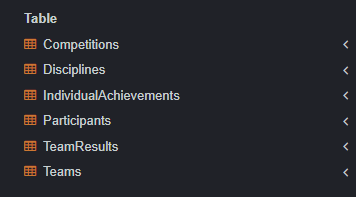

# НИЯУ МИФИ. ИИКС. Лабораторная работа №1-2. «Работа с данными. Простые запросы на выборку». Ступников Иван, Б20-505. 2023.

## Список выполненных простых запросов SQL 

### Создание и заполнение таблиц
   Был выполнен [SQL сценарий для создания таблиц в SQLite](./organization.sql). 

   Результат: создания таблицы 
  
  Созданы тестовые записи в таблице school. 
  ```
-- Добавляем дисциплины
INSERT INTO Disciplines (Name, Description) VALUES ('Football', 'A team sport played with a spherical ball.');
INSERT INTO Disciplines (Name, Description) VALUES ('Basketball', 'A team sport played with a round ball and a hoop.');

-- Добавляем команды
INSERT INTO Teams (Name, DisciplineID) VALUES ('Team A', 1);
INSERT INTO Teams (Name, DisciplineID) VALUES ('Team B', 1);
INSERT INTO Teams (Name, DisciplineID) VALUES ('Team C', 2);
INSERT INTO Teams (Name, DisciplineID) VALUES ('Team D', 2);

-- Добавляем участников
INSERT INTO Participants (Name, Age, TeamID) VALUES ('John Doe', 25, 1);
INSERT INTO Participants (Name, Age, TeamID) VALUES ('Jane Smith', 24, 1);
INSERT INTO Participants (Name, Age, TeamID) VALUES ('Alice Johnson', 23, 2);
INSERT INTO Participants (Name, Age, TeamID) VALUES ('Bob Brown', 22, 2);
INSERT INTO Participants (Name, Age, TeamID) VALUES ('Charlie White', 21, 3);
INSERT INTO Participants (Name, Age, TeamID) VALUES ('David Black', 20, 3);
INSERT INTO Participants (Name, Age, TeamID) VALUES ('Eve Green', 19, 4);
INSERT INTO Participants (Name, Age, TeamID) VALUES ('Frank Blue', 18, 4);

-- Добавляем соревнования
INSERT INTO Competitions (Name, Date, DisciplineID) VALUES ('Football Championship', '2023-09-15', 1);
INSERT INTO Competitions (Name, Date, DisciplineID) VALUES ('Basketball Tournament', '2023-09-16', 2);

-- Добавляем результаты команд
INSERT INTO TeamResults (CompetitionID, TeamID, Score) VALUES (1, 1, 3);
INSERT INTO TeamResults (CompetitionID, TeamID, Score) VALUES (1, 2, 2);
INSERT INTO TeamResults (CompetitionID, TeamID, Score) VALUES (2, 3, 100);
INSERT INTO TeamResults (CompetitionID, TeamID, Score) VALUES (2, 4, 98);

-- Добавляем индивидуальные достижения
INSERT INTO IndividualAchievements (ParticipantID, Description, Date, Score) VALUES (1, 'Scored a goal', '2023-09-15', 1);
INSERT INTO IndividualAchievements (ParticipantID, Description, Date, Score) VALUES (2, 'Assisted a goal', '2023-09-15', 1);
INSERT INTO IndividualAchievements (ParticipantID, Description, Date, Score) VALUES (3, 'Scored a basket', '2023-09-16', 2);
INSERT INTO IndividualAchievements (ParticipantID, Description, Date, Score) VALUES (4, 'Blocked a shot', '2023-09-16', 1);

  ```
### Простые запросы на выборку
  1. Вывести все записи из таблицы teachers:
   ```
  SELECT * FROM teachers;
  ```
  
  
  2. Вывести названия всех предметов из таблицы subjects:
   ```
  SELECT name FROM subjects;
  ```
  
  
  3. Вывести имена всех групп из таблицы groups:
   ```
  SELECT name FROM groups;
  ```
  
  
  4. Вывести имена студентов и их принадлежность к группе из таблицы students:
   ```
  SELECT s.name, g.name AS group_name
  FROM students s
  JOIN groups g ON s.group_id = g.group_id;
  ```
  
  
  5. Вывести расписание занятий для группы с идентификатором 1 из таблицы schedule:
   ```
  SELECT *
  FROM schedule
  WHERE group_id = 1;
  ```
  
  
  6. Вывести оценки студента с идентификатором 1 из таблицы grades:
   ```
  SELECT *
FROM grades
WHERE student_id = 1;
  ```
  
  
  7. Вывести имена родителей студента с идентификатором 1 из таблицы parents:
   ```
  SELECT p.name
FROM parents p
JOIN studentparents sp ON p.parent_id = sp.parent_id
WHERE sp.student_id = 1;
  ```
  
  
  8. Вывести статус посещаемости для студента с идентификатором 2 из таблицы attendance:
   ```
  SELECT status
FROM attendance
WHERE student_id = 2;
  ```
  

## Заключение
База данных была заполнена тестовыми данными. На этих данных были выполнены простые запросы на выборку, которые могут понадобиться при работе данного магазина.
