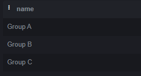
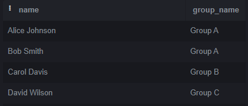
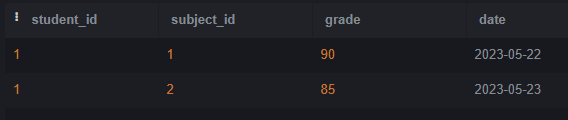
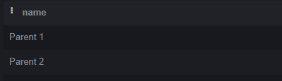

# НИЯУ МИФИ. ИИКС. Лабораторная работа №1-2. «Работа с данными. Простые запросы на выборку». Ступников Иван, Б20-505. 2023.

## Список выполненных простых запросов SQL 

### Создание и заполнение таблиц
   Был выполнен [SQL сценарий для создания таблиц в SQLite](./school.sql). 

   Результат: создания таблицы 
  
  Созданы тестовые записи в таблице school. 
  ```
  INSERT INTO teachers (name) VALUES
  ('John Smith'),
  ('Jane Doe'),
  ('David Johnson');

INSERT INTO subjects (name) VALUES
  ('Mathematics'),
  ('Science'),
  ('History');

INSERT INTO groups (name) VALUES
  ('Group A'),
  ('Group B'),
  ('Group C');

INSERT INTO students (name, group_id) VALUES
  ('Alice Johnson', 1),
  ('Bob Smith', 1),
  ('Carol Davis', 2),
  ('David Wilson', 3);

INSERT INTO schedule (group_id, subject_id, teacher_id, schedule_date) VALUES
  (1, 1, 1, '2023-05-22'),
  (1, 2, 2, '2023-05-23'),
  (2, 3, 1, '2023-05-24'),
  (3, 1, 3, '2023-05-25');

INSERT INTO grades (student_id, subject_id, grade, date) VALUES
  (1, 1, 90, '2023-05-22'),
  (1, 2, 85, '2023-05-23'),
  (2, 1, 95, '2023-05-22'),
  (2, 2, 92, '2023-05-23'),
  (3, 3, 88, '2023-05-24'),
  (4, 1, 87, '2023-05-25');

INSERT INTO parents (name) VALUES
  ('Parent 1'),
  ('Parent 2'),
  ('Parent 3');

INSERT INTO studentparents (student_id, parent_id) VALUES
  (1, 1),
  (1, 2),
  (2, 1),
  (3, 3);

INSERT INTO attendance (student_id, date, status) VALUES
  (1, '2023-05-22', 'Present'),
  (1, '2023-05-23', 'Present'),
  (2, '2023-05-23', 'Absent'),
  (3, '2023-05-24', 'Present'),
  (4, '2023-05-25', 'Present');

  ```
### Простые запросы на выборку
  1. Вывести все записи из таблицы teachers:
   ```
  SELECT * FROM teachers;
  ```
  
  
  2. Вывести названия всех предметов из таблицы subjects:
   ```
  SELECT name FROM subjects;
  ```
  
  
  3. Вывести имена всех групп из таблицы groups:
   ```
  SELECT name FROM groups;
  ```
  
  
  4. Вывести имена студентов и их принадлежность к группе из таблицы students:
   ```
  SELECT s.name, g.name AS group_name
  FROM students s
  JOIN groups g ON s.group_id = g.group_id;
  ```
  
  
  5. Вывести расписание занятий для группы с идентификатором 1 из таблицы schedule::
   ```
  SELECT *
  FROM schedule
  WHERE group_id = 1;
  ```
  
  
  6. Вывести оценки студента с идентификатором 1 из таблицы grades::
   ```
  SELECT *
FROM grades
WHERE student_id = 1;
  ```
  
  7. Вывести имена родителей студента с идентификатором 1 из таблицы parents::
   ```
  SELECT p.name
FROM parents p
JOIN studentparents sp ON p.parent_id = sp.parent_id
WHERE sp.student_id = 1;
  ```
  
  8. Вывести статус посещаемости для студента с идентификатором 2 из таблицы attendance:
   ```
  SELECT status
FROM attendance
WHERE student_id = 2;
  ```
  

## Заключение
База данных была заполнена тестовыми данными. На этих данных были выполнены простые запросы на выборку, которые могут понадобиться при работе данного магазина.
