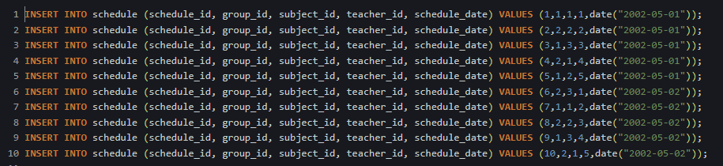
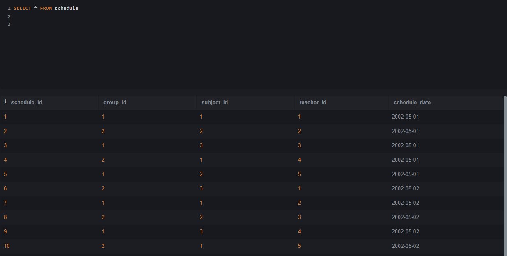

# НИЯУ МИФИ. ИИКС. Лабораторная работа №1-2. «Работа с данными. Простые запросы на выборку». Ступников Иван, Б20-505. 2023.

## Список выполненных простых запросов SQL 

### Создание и заполнение таблиц
   Был выполнен [SQL сценарий для создания таблиц в SQLite](./school.sql). 

   Результат: создания таблицы 
  
  Созданы тестовые записи в таблице school. 
### Простые запросы на выборку
  1. Получить все предметы со всеми полями из таблицы school 

## Заключение
База данных была заполнена тестовыми данными. На этих данных были выполнены простые запросы на выборку, которые могут понадобиться при работе данного магазина.
